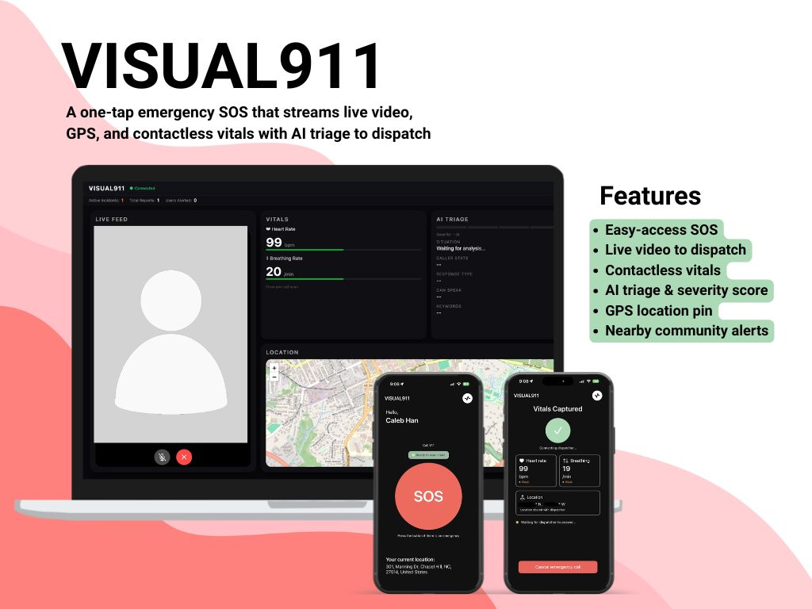

# Visual911

<div align="center">
  
</div>

A community-aware emergency response system. One SOS call alerts everyone nearby, gives dispatchers live video and AI triage, and lets the community know in real time when help is needed.

---

## The Problem

Emergencies don't happen in isolation — but current 911 systems treat every call as a private, one-to-one event. Two people call about the same house fire from opposite sides of the building. A dozen bystanders hear a crash but don't know if help is already coming. And millions of callers who can't speak — cardiac patients, domestic violence victims, people with throat injuries — connect to 911 and hear silence in return.

## What Visual911 Does

A caller taps **SOS** on their iPhone. Simultaneously:

1. Runs a **15-second contactless vitals scan** — heart rate and breathing rate from the front camera alone (Presage SmartSpectra SDK, no wearable needed)
2. Opens a **live WebRTC video call** directly to the dispatcher's browser
3. Streams call audio to **Gemini AI** for real-time triage analysis every 10 seconds
4. Sends **GPS coordinates** and vitals to the dispatcher dashboard
5. **Broadcasts a community alert** to all nearby Visual911 users — showing incident location, severity, and corroborating report count

The dispatcher sees: live video, biometric readings, an AI-generated situation summary with severity score, a location pin, and a real-time count of corroborating reports — all in one screen.

Nearby community members see: an alert banner on their phone with incident count, report tally, and severity level.

---

## Architecture

```
┌──────────────┐        WebRTC P2P         ┌──────────────────┐
│   iPhone     │◄────── video/audio ──────►│  Dispatcher      │
│   (caller)   │                           │  Browser         │
└──────┬───────┘                           └────────┬─────────┘
       │ WebSocket                                  │ WebSocket
       │ (signal, audio, vitals)                    │ (dashboard)
       ▼                                            ▼
┌──────────────────────────────────────────────────────────────┐
│                    Vultr VPS (server.py)                     │
│  Incident clustering · Community alerts · Gemini triage      │
│  WebSocket hub · TURN credentials                            │
└──────────────────┬───────────────────────────────────────────┘
                   │ /ws/alerts (broadcast)
                   ▼
         ┌──────────────────┐
         │  Idle iPhones    │  ← community alert banner
         │  (community)     │
         └──────────────────┘
```

- **iOS caller → Server**: 3 WebSockets (signaling, audio PCM + JPEG frames, vitals JSON)
- **iOS idle → Server**: 1 persistent WebSocket (`/ws/alerts`) for community broadcast
- **Server → Gemini**: Batch `generateContent` every 10s with buffered WAV audio + latest video frame
- **Server → Dashboard**: Triage updates, vitals relay, call lifecycle, incident clustering metrics
- **iOS ↔ Dashboard**: Direct WebRTC peer-to-peer video/audio (TURN-assisted if needed)

---

## Community Alert Flow

```
SOS pressed → server clusters call into incident (50m radius)
  ├─► Broadcasts community_alert to all /ws/alerts subscribers
  │    └─► Idle iPhones show: "1 incident nearby · 1 report"
  └─► Sends incident_update to dispatcher dashboard
       └─► Map pin appears with "1" badge

Second SOS from same location → report_count: 2
  ├─► Alert updates: "1 incident nearby · 2 reports"
  └─► Dashboard badge: "1" → "2" (with flash animation)
      Metrics bar: "Active Incidents: 1 · Total Reports: 2 · Users Alerted: 1"
```

---

## Stack

| Layer | Technology |
|---|---|
| iOS App | Swift/SwiftUI, Presage SmartSpectra SDK, stasel/WebRTC, AVAudioEngine, CoreLocation |
| Backend | Python 3.11+, asyncio, aiohttp, google-genai, python-dotenv |
| AI | Gemini 2.5 Flash (batch generateContent with cumulative context) |
| Infrastructure | Vultr Ubuntu VPS, coturn TURN server, Let's Encrypt SSL |
| Dispatcher UI | Plain HTML/CSS/JS, Leaflet.js, WebRTC browser API |
| Domain | visual911.mooo.com |

---

## Repo Structure

```
/
├── ios/
│   ├── project.yml             # XcodeGen spec → generates .xcodeproj
│   ├── Config.swift            # Server URLs, demo location override
│   ├── Secrets.swift           # API keys (gitignored)
│   ├── CallManager.swift       # Call lifecycle state machine
│   ├── AlertsClient.swift      # /ws/alerts subscriber (idle community alerts)
│   ├── PresageManager.swift    # Presage SDK wrapper
│   ├── WebRTCManager.swift     # WebRTC peer connection
│   ├── SignalingClient.swift   # /ws/signal WebSocket
│   ├── AudioTap.swift          # AVAudioEngine → /ws/audio
│   ├── VitalsClient.swift      # /ws/vitals WebSocket
│   ├── TURNCredentials.swift   # HMAC-SHA1 TURN credential generation
│   └── Views/                  # SwiftUI views per call state
├── server/
│   ├── server.py               # Single-file Python backend
│   ├── sim_caller.py           # Demo script: simulates a second caller
│   ├── requirements.txt        # Pinned dependencies
│   └── static/index.html       # Dispatcher dashboard
└── docs/                       # Detailed implementation docs
```

---

## Getting Started

See [CONTRIBUTING.md](CONTRIBUTING.md) for full setup instructions (iOS, server, dashboard).

```bash
# Server
cd server
python -m venv .venv && source .venv/bin/activate
pip install -r requirements.txt
echo 'GEMINI_API_KEY=your-key' > .env
python server.py

# Simulate a second caller (incident clustering demo)
python sim_caller.py --host localhost --lat 35.9132 --lng -79.0558

# iOS — open ios/ in Xcode, copy Secrets.swift.example → Secrets.swift, run on device
```

## License

[MIT](LICENSE)
